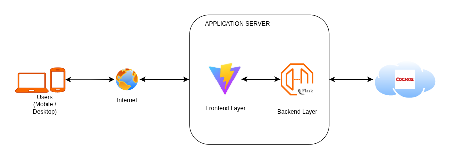

# System Architecture & Technical Documentation
## Football Teammate Network

**Version:** 1.0.0
**Date:** August 2026
**Author:** Eyang, Daniel Eyoh
**Repository:** [GitHub URL](https://github.com/tediyang/players-club-relationship)

---

## 1. Executive Summary

The **Football Teammate Network** is a lightweight, graph-native web application designed to demonstrate the power of graph databases over traditional relational schemas. It models the professional careers of football (soccer) players and their club affiliations.

The core business capability is **relationship discovery** specifically, finding the shortest connection path between two players via shared clubs, and performing complex exclusionary queries (e.g., "Players connected to Messi's teammates but who have never played for Barcelona"). The system is built using **CognoDB** (a managed Neo4j-compatible graph database), **Flask** (Python) and **ReactJS** for UI.

---

## 2. Architectural Drivers & Non-Functional Requirements (NFRs)

The following NFRs guided all technical decisions:

| NFR | Constraint / Target | Justification |
| :--- | :--- | :--- |
| **Performance** | Sub-second response for path queries | Graph traversals (hops `*1..3`) are pointer-chasing operations; must execute faster than recursive SQL CTEs. |
| **Simplicity** | Minimal external dependencies | The stack must be easily explainable and debuggable. |
| **Resilience** | Graceful degradation | The UI must not crash if the database is unreachable; it must display explicit "unavailable" states. |
| **Security** | Zero credential leakage | Connection secrets must be strictly externalized to the runtime environment. |
| **Maintainability** | Layer separation | Clear distinction between data access, business logic, and presentation layers. |

---

## 3. Technology Stack & Selection Rationale

| Layer | Technology | Rationale |
| :--- | :--- | :--- |
| **Database** | **CognoDB** (Neo4j 5.x / Bolt 5.0-5.4) | Native graph traversal capabilities. Eliminates the "object-relational impedance mismatch" for network data. Managed cloud reduces operational overhead. |
| **Driver** | `neo4j` (Python) v5.14+ | Official driver ensures compatibility with Bolt protocol and supports connection pooling. |
| **Backend** | **Flask** 2.3+ (Python 3.9+) | Lightweight WSGI framework. Minimal boilerplate; rapid development.|
| **Frontend** | **ReactS (Vite) / TailwindCSS** | Uses Vite and TailwindCSS for styling |
| **Deployment** | **Gunicorn** (Flask) + **Render.com** | Gunicorn handles concurrent requests; platform free tiers offer automatic HTTPS and environment variable injection. |
| **Configuration** | `python-dotenv` | Standard 12-factor app configuration; separates code from runtime secrets. |

---

## 4. System Context (C4 Model – Level 1 & 2)

### 4.1 System Context Diagram


### 4.2 Container Architecture (Level 2)
The application is a single-container (monolithic) web service, logically segmented into four distinct architectural layers:

1. **Presentation Layer** (ReactJS (Vite))
   - JavaScript performs asynchronous `fetch()` calls to the backend API.
   - **Key Pattern**: State management via DOM manipulation; displays explicit Loading, Empty, and Error states.

2. **API Gateway Layer** (Flask Routes)
   - Exposes RESTful endpoints: `/api/path`, `/api/indirect`, `/api/squads`, `/api/health`
   - Acts as the authentication/authorization boundary (minimal in this context).
   - Handles HTTP request/response serialization (JSON).

3. **Business Logic / Query Layer** (`db/queries.py`)
   - Encapsulates the Cypher query strings.
   - Translates domain concepts (Players, Clubs) into database queries.
   - **Critical**: All queries are **parameterized**, preventing Cypher injection and allowing query plan caching.

4. **Data Access Layer** (`db/connection.py`)
   - Manages the Neo4j Driver lifecycle (connection pooling, session creation).
   - Provides a generic `execute_query` method that handles exceptions and converts records to Python dictionaries.
   - Implements a **health check** mechanism to verify connectivity before serving requests.

---

## 5. Data Architecture (Graph Data Model)

### 5.1 Logical Data Model
The graph follows a **bipartite structure** connecting Players to Clubs via a single relationship type.

```cypher
(:Player {name: string}) 
    -[:PLAYED_FOR]-> 
(:Club {name: string})
```
**Cardinalities**: <br>
Player → Club: Many-to-Many. A player transfers between clubs; a club houses many players over time.

### 5.2 Idempotent Data Seeding
The seed/load_data.py script uses MERGE (Match or Create) rather than CREATE. This ensures the script can be run multiple times without creating duplicate nodes or relationships—a crucial feature for CI/CD pipelines and development environment resets.

## 6. Application Architecture – Detailed Component Interaction
### 6.1 Request Flow (Shortest Path Query)
- User Action: Submits "Messi" and "Ronaldo" in the UI.

- Client: JavaScript sends GET /api/path?player1=Messi&player2=Ronaldo.

- Flask Route: Extracts query parameters, validates non-empty strings.

- Query Layer: Calls find_shortest_path(db, "Messi", "Ronaldo").

- Data Access Layer: <br>
Acquires a session from the driver pool.
Runs: MATCH path = (p1 {name: $a})-[:PLAYED_FOR*1..5]-(p2 {name: $b}) ...
The database traverses the graph until it finds a path (or exhausts depth 5).

- Response Mapping: The path is transformed into a sequence of node names (alternating Player/Club).

- UI Render: The breadcrumb string (e.g., Messi → PSG → Beckham → Real Madrid → Ronaldo) is displayed.

### 6.2 Complex Query Execution (The "Relational Awkward" Query)
- Business Intent: Find players who share a club with a teammate of the star player, but exclude those who ever played for the star's primary rival.

**Execution Path**:

Matches star → c1 → teammate → c2 → distant.

Applies the exclusion WHERE NOT (distant)-[:PLAYED_FOR]->(:Club {name: $exclude}).

Relational systems struggle here because they require a negative subquery over a potentially deep join tree. In Cypher, the traversal and the exclusion are evaluated in the same logical pass, preventing expensive temporary table creation.

## 7. Security Architecture
### 7.1 Secrets Management
**Principle**: Zero secrets in the repository.

**Implementation**: The .env file is excluded via .gitignore. The application loads variables (COGNODB_URI, COGNODB_USER, COGNODB_PASSWORD) strictly from the environment.

**Runtime Injection**: In production (Render), these are injected as secure environment variables via the platform's web UI—never printed to logs.

### 7.2 Query Injection Prevention
**Mechanism**: The neo4j driver automatically escapes parameters passed via the parameters dictionary. String concatenation (f"WHERE name='{user}'") is strictly forbidden in the codebase.

**Verification**: All query functions in queries.py use the $placeholder syntax exclusively.

### 8. Operational Resilience & Error Handling
## 8.1 Startup and Liveness
The app.py orchestrates a "best-effort" connection during before_first_request.

If the connection fails, the db_ready flag remains False.

The /api/health endpoint exposes the connection status, allowing frontend monitoring.

## 8.2 Graceful Degradation
**Database Unreachable**: API endpoints return HTTP 503 (Service Unavailable) with a JSON error message.

**Missing Data**: If a player name does not exist in the graph, the query returns an empty list. The UI displays a custom "No connection found" empty state instead of a stack trace.

**Timeout/Exception**: Wrapped in try/except blocks at the Route layer. Exceptions are logged to the server log files, but the client receives a generic "Internal Server Error" (HTTP 500) to prevent exposing database internals.

## 9. Performance Optimization & Scaling Strategy
### 9.1 Query Optimization
**Depth Limiting**: The path query limits will be set to *1..3. This prevents the traversal from exploding if the graph is highly connected (e.g., a player connected to 50 clubs). It also ensures predictable response times (< 200ms on c0 hardware).

**Projection**: The query will only returns DISTINCT paths and limits the results to 3 or 5 depending on endpoint limit. This prevents overwhelming the frontend with hundreds of duplicate paths (especially in a dense network).

### 9.2 Future Scalability (If the dataset expands to 1M+ nodes)
**Indexing**: Move to composite indexes (e.g., (Player.name, Player.birth_year)).

**Read Replicas**: CognoDB supports followers; the Flask app could route read-heavy queries (like the path search) to replicas.

**Caching**: Implement Redis cache for frequently queried player pairs (e.g., Messi-Ronaldo) to reduce database load.

**Pagination**: Replace LIMIT with pagination (SKIP and LIMIT) for UI infinite scrolling.


## 10. Logging & Monitoring
**Application Logs and Error Logging**: The application logs are handled by flask app and logged into app.log and error.log files respectively.

**Health Probe**: The /api/health endpoint serves as a liveness probe. If unreachable, the orchestration platform automatically restarts the container.
