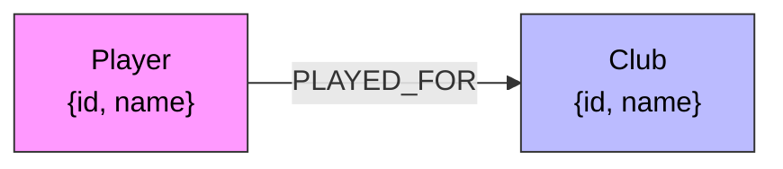

# **Player Club Relationship Backend**

This document describes the backend for the Players-Club Relationship project: the stack, a thoughtful graph data model, why a graph database was chosen, how to create a CognoDB instance, setup and run instructions, and the main queries used by the app.

## **Stack**

- **Language:** [Python3](https://www.python.org/)
- **Web framework:** [Flask](https://flask.palletsprojects.com/en/stable/)
- **Graph database:** [CognoDB](https://cognodb.com/)
- **Data:** CSV seed data stored in `football_players_career_history.csv`
- **DB layer:** simple connection and query helpers in `backend/db/`
- **Dependencies:** see `requirements.txt`

## **Use Case & Why a Graph Database?**

- Use case: model professional football players and their relationships to clubs, seasons, positions, and transfers. The application needs to answer relationship-centric queries such as "which players played together at a club", "shortest connection (degrees) between two players through clubs and teammates" etc.
- Why a graph DB: graphs are a natural fit for highly connected data. They express relationships as first-class citizens enabling fast traversal queries (neighborhood searches, pathfinding, pattern matching) which are inefficient in tabular relational joins. Graph databases make it simple and performant to run queries such as multi-hop traversals, shortest paths, and pattern matching for teams and transfers.

## **Graph Data Model (conceptual)**

Labeled nodes, typed relationships and properties. A compact mermaid diagram follows to visualise the core model.

Diagram showing Nodes, Relationship and Properties:



### Model details

- Node labels and key properties
  - `Player`: `id` (unique), `name`.
  - `Club`: `id` (unique), `name`.
- Relationship types and properties
  - `(:Player)-[:PLAYED_FOR]->(:Club)` — denotes a player's stint at a club with time range and stats.
  - `(:Player)-[:PLAYED_FOR]-(:Player)` — optional undirected-style edge to mark alumni of the same club.

## **Backend Setup**
### **Creating a CognoDB instance**
1. Go to https://console.cognodb.com/signup and sign up (free, no credit card required)

2. Create a free (c0) instance and choose a region (provisions in ~1 minute)

3. Save your connection details immediately:
```
URI format: bolt+s://<instance-id>.databases.cognodb.cloud

Username: cognodb

Password: shown only once – copy and save it immediately
```


### **Configure your Environemental Variables**
Create a .env file from the variables in .example.env and replace their values with the details you got from Congno DB instance:

```
COGNODB_URI=bolt+s://your-instance-id.databases.cognodb.cloud
COGNODB_USER=your-cognodb-username
COGNODB_PASSWORD=your-super-secret-password
```

### **Setup & Run (backend)**
**Perequisite**: <br>
You should have python3 installed on your system. If you don't have go to [python3](https://www.python.org/downloads/) and follow the installation step up.

1. Create a Python virtual environment and install dependencies

```bash
python3 -m venv .venv
source .venv/bin/activate
pip install -r requirements.txt
```

2. Seed the database with sample data

```bash
# from the backend folder
python -m seed.load_data
```

This script reads `football_players_career_history.csv` and creates nodes and relationships in the graph.

3. Run the Flask backend

```bash
flask run
```

The API will be available at `http://localhost:5000` by default.

**Main Queries & Explanation**

This section explains the main graph queries used by the backend and their intent. The actual query syntax will depend on CognoDB's query language (Cypher-like or vendor-specific). The examples below use a Cypher-like pseudocode that is readable and widely understood.
-   Find the clubs with the most connected players in our dataset:
```
  MATCH (c:Club)<-[:PLAYED_FOR]-(p:Player)
  RETURN c.name AS club, COUNT(p) AS player_count
  ORDER BY player_count DESC
  LIMIT 5
```
return a maximum of 5 clubs in descending order.

- Shortest connection between two players (degrees through clubs):

```
  // Find the top 1 match for player A
  CALL db.index.fulltext.queryNodes('player_names', $a)
  YIELD node AS p1, score AS score1
  WITH p1 ORDER BY score1 DESC LIMIT 1

  // Find the top 1 match for player B
  CALL db.index.fulltext.queryNodes('player_names', $b)
  YIELD node AS p2, score AS score2
  WITH p1, p2 ORDER BY score2 DESC LIMIT 1

  // Ensure distinct players
  WHERE p1 <> p2

  // Traverse graph for the two resolved players
  MATCH path = (p1)-[:PLAYED_FOR*1..3]-(p2)
  WITH path, nodes(path) AS nodes
  RETURN 
    [node IN nodes |
      CASE 
        WHEN 'Player' IN labels(node) THEN node.name
        ELSE '{' + node.name + '}'
      END
    ] AS sequence,
    length(path) AS hops
  ORDER BY hops ASCBruno Fernande
  LIMIT 3
```
etc.


## **Where to look in this repo**

- Main app entry: [app.py](app.py)
- Configuration: [config.py](config.py)
- DB helpers: [db/connection.py](db/connection.py) and [db/queries.py](db/queries.py)
- Seed data & loader: [seed/load_data.py](seed/load_data.py) and `football_players_career_history.csv`

## **Troubleshooting & Tips**

- If the seed fails, check the CognoDB server logs for authentication or schema errors.
- Confirm `COGNODB_URL`, `COGNODB_USER`, and `COGNODB_PASSWORD` are correct before running `seed.load_data`.

---

